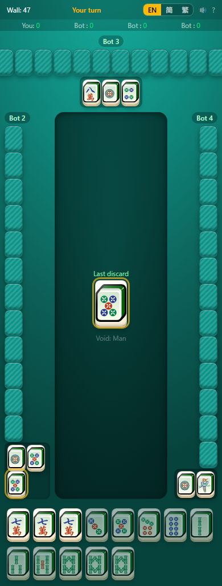
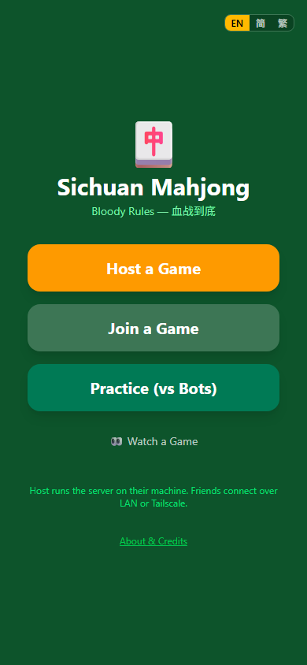
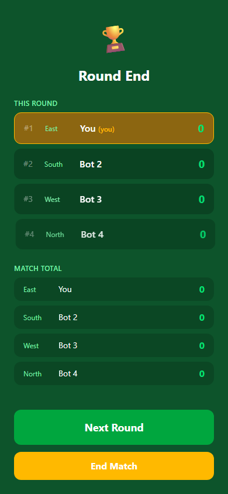
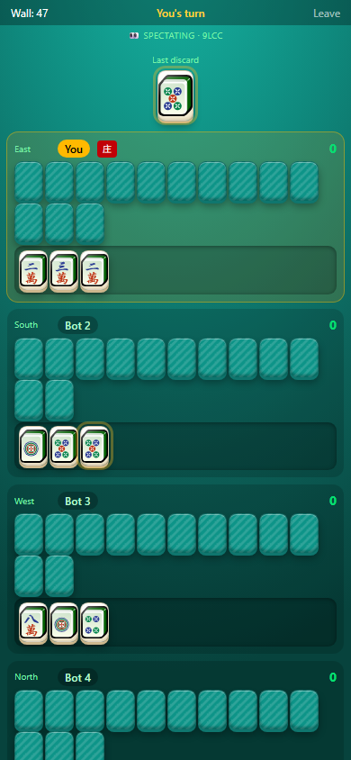

# Sichuan Mahjong

4-player Sichuan "Bloody Rules" (血战到底) mahjong, playable in any modern browser. The host runs a local server on their own machine and friends join over LAN or Tailscale — no accounts, no cloud.

<p align="center">
  
</p>

<p align="center">
  
  &nbsp;
  
  &nbsp;
  
</p>

## Features

- Full Bloody Rules engine: huan san zhang, void declaration (定缺), bloody-to-end sit-out, all 10 fan combinations, payment matrix, kong refunds
- Optional Flower Pig (花猪) house rule
- Heuristic bots (easy + medium) — practice solo or fill empty seats
- Multi-round matches with running totals; host starts each round or ends the match
- Spectator mode — watch any game read-only with a code (no hand exposed)
- Trilingual UI — English / 简体中文 / 繁體中文
- Mobile-first PWA (installs to home screen over HTTPS/Tailscale)
- LAN play out of the box — no setup beyond running the server
- Cross-network play via [Tailscale](https://tailscale.com), with `--share` to auto-create a share invite
- Reconnect within 60 s of disconnect; bot takes over after that, and you reclaim your seat next round
- Crash-safe: in-progress games are snapshotted and resume after a server restart

---

## Playing the game

### As host (running the server)

**Option A — npx (requires Node 22+)**

```sh
npx sichuan-mahjong
```

**Option B — precompiled binary (no Node required)**

Download the binary for your OS from [GitHub Releases](../../releases), then run it:

```sh
# macOS / Linux
chmod +x sichuan-mahjong-macos-arm64
./sichuan-mahjong-macos-arm64

# Windows
sichuan-mahjong-windows-x64.exe
```

The server prints your share URLs on startup:

```
🀄  Sichuan Mahjong — running on this machine

   LAN:        http://192.168.1.50:8080       ← same WiFi
   mDNS:       http://mahjong.local:8080      ← same WiFi (Apple / Linux)
   Tailscale:  https://laptop.ts.net:8443     ← anywhere

   Lobby code:  HKQM
```

Share the URL (or just the 4-letter code) with your friends. You can also add bots in the lobby to fill any empty seats.

**CLI options**

| Flag | Default | Description |
|---|---|---|
| `--port` | `8080` | HTTP port |
| `--https-port` | `8443` | HTTPS port (Tailscale only) |
| `--no-mdns` | — | Disable mDNS broadcast |
| `--no-tailscale` | — | Disable Tailscale detection |
| `--data-dir` | OS user data dir | Where to store the SQLite database |

### As a joiner (connecting to someone else's game)

1. Open the URL the host shared, **or** go to the host's IP address and enter the 4-letter lobby code.
2. Type your name and tap **Join**.
3. Wait in the lobby until the host starts the game.

No install, no account — just a browser.

### Cross-network play via Tailscale

If you want friends outside your LAN to join:

1. The host installs [Tailscale](https://tailscale.com) (free, 5 min setup).
2. In the Tailscale admin console → **Machines** → your machine → **Share**. Send the share invite.
3. Each friend accepts once (creates a free Tailscale account). They only get access to your mahjong machine.
4. They open the `https://…ts.net:8443/j/CODE` URL the server printed. Done.

The same URL works for every future game — no re-sharing needed.

---

## Rules overview

Sichuan Bloody Rules — each player voids a suit and must discard it. The round continues after the first Hu until three players have won or the wall is exhausted.

For the full ruleset see **[ARCHITECTURE.md §5](./ARCHITECTURE.md#5-sichuan-rules-the-engine-encodes)** (based on Vitaly Novikov's *Sichuan Mahjong? It's that simple!*) or tap **?** in the top-right corner of the game screen.

---

## Development

**Prerequisites:** Node 22+, pnpm 10+

```sh
pnpm install

# Build everything
pnpm --filter @sichuan-mahjong/engine build
pnpm --filter @sichuan-mahjong/client build
pnpm --filter sichuan-mahjong build

# Run the server (serves the built client)
pnpm --filter sichuan-mahjong start

# Tests
pnpm test        # Vitest (engine + server unit/integration tests)
pnpm e2e         # Playwright end-to-end (full round with 3 bots)

# Typecheck / lint
pnpm typecheck
pnpm lint
```

Client hot-reload during development:

```sh
# Terminal 1 — server
pnpm --filter sichuan-mahjong start

# Terminal 2 — Vite dev server (proxies API to :8080)
pnpm --filter @sichuan-mahjong/client dev
```

For architecture details, type system, engine API, and design decisions see **[ARCHITECTURE.md](./ARCHITECTURE.md)**.

---

## License

Code: [MIT](./LICENSE)

Tile SVGs in `packages/client/public/tiles/`: [CC BY-SA 4.0](https://creativecommons.org/licenses/by-sa/4.0/) via Wikimedia Commons. Attribution in [`credits.json`](./packages/client/public/tiles/credits.json), surfaced at `/about`.
